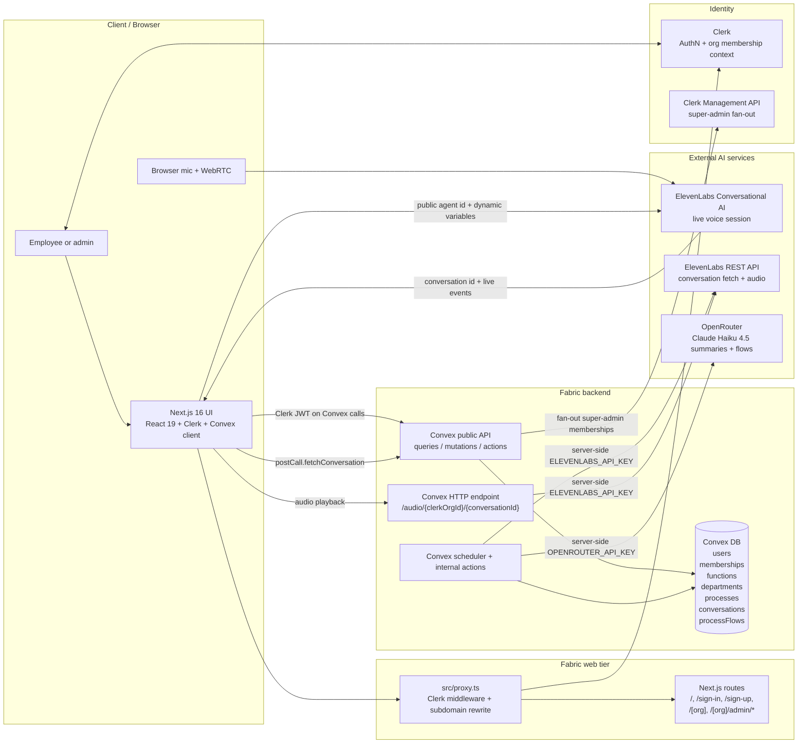

# Platform Architecture And Security Overview

This document reflects the current repository state as of 2026-04-21. It is a current-state view of the implemented platform, not a target-state architecture.

## Current-State Architecture

## Runtime Notes

- Apex traffic serves the landing/sign-in experience. Signed-in users on the apex domain are redirected to their active or first available org subdomain.
- Org subdomain traffic is rewritten to the `src/app/[org]` tree by `src/proxy.ts`, and Clerk organization sync activates the matching org in the session.
- The frontend uses `ConvexProviderWithClerk`, so public Convex queries, mutations, and actions execute with the caller's Clerk JWT.
- Fabric stores tenant data in Convex. The main business hierarchy is `functions -> departments -> processes -> conversations`, with `processFlows` storing generated diagrams and `memberships` storing per-org roles.
- Live recording is browser-to-ElevenLabs over WebRTC. Fabric does not proxy the live microphone stream.
- After a recording ends, the browser calls `postCall.fetchConversation`. Convex polls ElevenLabs for the finished conversation, stores transcript/analysis in `conversations`, and then schedules summary regeneration.
- Process summaries are generated first. Department and function summaries are derived from lower-level summaries. Process flow diagrams are generated from summaries plus structured conversation analysis.
- Audio playback uses the Convex `/audio/...` HTTP endpoint because a native `<audio>` element cannot attach Clerk JWT headers reliably.
- Platform super-admin access is separate from tenant roles. Super-admin fan-out uses Clerk's management API plus mirrored `memberships` rows in Convex.

## Security Overview

### Identity And Access Control

- Authentication is handled by Clerk, and Convex validates Clerk-issued JWTs through `convex/auth.config.ts`.
- Org context is derived from the active Clerk organization and reinforced by subdomain routing in `src/proxy.ts`.
- Tenant authorization is enforced in Convex through `requireOrgMember`, `requireOrgContributor`, and `requireOrgAdmin` in `convex/lib/orgAuth.ts`.
- Platform-wide administration is intentionally separate from tenant access. `users.platformRole = "superAdmin"` grants platform capabilities, but tenant data access still depends on a real org membership row.
- Admin pages are gated twice: client-side route checks in the Next app and server-side role checks in Convex mutations/queries.

### Tenant Isolation

- Tenant-owned tables are stamped with `clerkOrgId`, and most read/write paths query via org-scoped indexes.
- Cross-org access is usually returned as `null`, `[]`, or `Not found` rather than `Forbidden`, which reduces tenant-enumeration leakage.
- Action entrypoints resolve `orgId` from the authenticated JWT, then pass `clerkOrgId` explicitly into internal queries and mutations. This keeps internal actions from implicitly operating outside the caller's tenant.
- `assertOrgOwns` is used as a defense-in-depth ownership check before mutating parent-child records.

### Secrets And Third-Party Boundaries

- Client-visible configuration is limited to `NEXT_PUBLIC_*` values such as the Convex URL, Clerk publishable key, root domain, and ElevenLabs agent id.
- Sensitive secrets stay server-side in Convex environment variables: `ELEVENLABS_API_KEY`, `OPENROUTER_API_KEY`, `CLERK_SECRET_KEY`, `CLERK_JWT_ISSUER_DOMAIN`, and `CLIENT_ORIGIN`.
- The main external data boundaries are:
  - ElevenLabs: live voice sessions, transcript retrieval, and audio retrieval.
  - OpenRouter / Claude: process, department, and function summaries plus process-flow generation.
- From a compliance perspective, these external AI calls are the most important data-sharing boundary in the platform.

### Public Attack Surface

- The main authenticated surface is the Next app plus public Convex functions called with Clerk JWTs.
- The only explicit public HTTP endpoint in the repo is `/audio/{clerkOrgId}/{elevenlabsConversationId}`.
- The audio endpoint checks that the requested conversation exists in the specified org. If the caller has a valid session, it also checks that the token's active org matches the URL org.
- The audio endpoint exists because browser audio playback is awkward with bearer-token headers, but it does mean audio access is not purely JWT-gated.
- CORS for the audio endpoint is controlled by `CLIENT_ORIGIN`. If that env var is unset, the code falls back to `"*"`, which is acceptable for local development but too permissive for production.

### Operational Safety Rails

- Org-member management prevents demoting or removing the last org admin.
- Platform role management prevents self-demotion from the last known super-admin session.
- Super-admin fan-out is designed to be idempotent on both the Clerk side and the Convex membership side.
- Integrity helpers exist to audit and repair orphaned hierarchy records inside an org.
- Cleanup tooling exists for seeded/test conversation records, but there is no broader retention lifecycle in the current code.

## Current Gaps And Hardening Priorities

1. Replace anonymous audio URL access with signed, expiring URLs or a short-lived tokenized proxy path.
2. Set `CLIENT_ORIGIN` explicitly in every non-local environment and avoid the wildcard fallback in production.
3. Add security headers at the web layer, especially CSP, frame restrictions, and stricter transport/header policy where compatible with Clerk and Convex.
4. Add audit logging for membership changes, platform-role changes, conversation imports, and AI-generated document updates.
5. Define retention and deletion rules for transcripts, audio, analysis payloads, and LLM-generated summaries.
6. Rework `users.function` and `users.department` away from global strings toward org-scoped references before broader multi-tenant rollout. The current rename cascades can affect future tenants that reuse the same labels.
7. Consider rate limiting or abuse controls on public HTTP endpoints and expensive action entrypoints that trigger third-party API usage.

## Short Summary

Fabric currently uses a solid baseline pattern for B2B multi-tenancy: Clerk for identity, subdomain-to-org routing, Convex for server-side authorization, and `clerkOrgId` stamped across tenant records. The main security strengths are server-side role enforcement and consistent org scoping across Convex reads and writes.

The biggest present-day risk concentration is around third-party AI data egress and the semi-public audio playback path. Those are the two areas that would benefit most from the next round of hardening work.
