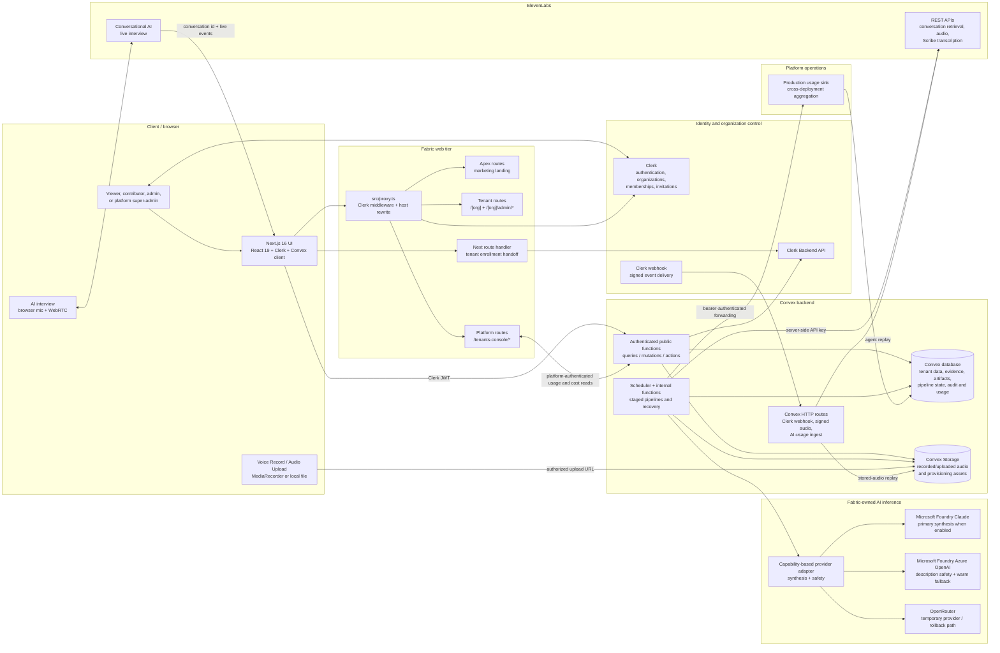

# Fabric Platform Architecture and Security Overview

This document reflects the implemented repository state as of **17 August 2026**. It describes the architecture the code supports. Runtime choices controlled by deployment environment variables—most notably the active AI provider—must be verified against the target Convex deployment before an operational or compliance review.

For product behavior, see [PRD.md](PRD.md). For Foundry deployment and cutover state, see [docs/foundry-migration-runbook.md](docs/foundry-migration-runbook.md).

## Current-State Architecture

```mermaid
flowchart LR
  subgraph Client["Client / browser"]
    User["Viewer, contributor, admin,<br/>or platform super-admin"]
    UI["Next.js 16 UI<br/>React 19 + Clerk + Convex client"]
    AgentCapture["AI interview<br/>browser mic + WebRTC"]
    StoredCapture["Voice Record / Audio Upload<br/>MediaRecorder or local file"]
  end

  subgraph Web["Fabric web tier"]
    Proxy["src/proxy.ts<br/>Clerk middleware + host rewrite"]
    Apex["Apex routes<br/>marketing landing"]
    OrgApp["Tenant routes<br/>/[org] + /[org]/admin/*"]
    TenantConsole["Platform routes<br/>/tenants-console/*"]
    JoinAPI["Next route handler<br/>tenant enrollment handoff"]
  end

  subgraph Identity["Identity and organization control"]
    Clerk["Clerk<br/>authentication, organizations,<br/>memberships, invitations"]
    ClerkAPI["Clerk Backend API"]
    ClerkWebhook["Clerk webhook<br/>signed event delivery"]
  end

  subgraph Backend["Convex backend"]
    PublicAPI["Authenticated public functions<br/>queries / mutations / actions"]
    Scheduler["Scheduler + internal functions<br/>staged pipelines and recovery"]
    Http["Convex HTTP routes<br/>Clerk webhook, signed audio,<br/>AI-usage ingest"]
    DB[("Convex database<br/>tenant data, evidence, artifacts,<br/>pipeline state, audit and usage")]
    Storage[("Convex Storage<br/>recorded/uploaded audio<br/>and provisioning assets")]
  end

  subgraph Voice["ElevenLabs"]
    ConvAI["Conversational AI<br/>live interview"]
    VoiceAPI["REST APIs<br/>conversation retrieval, audio,<br/>Scribe transcription"]
  end

  subgraph AI["Fabric-owned AI inference"]
    Adapter["Capability-based provider adapter<br/>synthesis + safety"]
    FoundryClaude["Microsoft Foundry Claude<br/>primary synthesis when enabled"]
    FoundryOpenAI["Microsoft Foundry Azure OpenAI<br/>description safety + warm fallback"]
    OpenRouter["OpenRouter<br/>temporary provider / rollback path"]
  end

  subgraph Ops["Platform operations"]
    UsageSink["Production usage sink<br/>cross-deployment aggregation"]
  end

  User --> UI
  UI --> Proxy
  Proxy --> Apex
  Proxy --> OrgApp
  Proxy --> TenantConsole
  UI --> JoinAPI

  User <--> Clerk
  Proxy --> Clerk
  JoinAPI --> ClerkAPI
  ClerkWebhook --> Http
  PublicAPI --> ClerkAPI

  UI -->|"Clerk JWT"| PublicAPI
  PublicAPI --> DB
  Scheduler --> DB
  PublicAPI --> Storage
  Scheduler --> Storage

  AgentCapture <--> ConvAI
  ConvAI -->|"conversation id + live events"| UI
  StoredCapture -->|"authorized upload URL"| Storage
  Scheduler -->|"server-side API key"| VoiceAPI
  Http -->|"agent replay"| VoiceAPI
  Http -->|"stored-audio replay"| Storage

  Scheduler --> Adapter
  Adapter --> FoundryClaude
  Adapter --> FoundryOpenAI
  Adapter --> OpenRouter

  Scheduler -->|"bearer-authenticated forwarding"| UsageSink
  UsageSink --> DB
  TenantConsole <-->|"platform-authenticated usage and cost reads"| PublicAPI
```

### Diagram interpretation

- The diagram shows supported paths, not that every provider is active simultaneously.
- `AI_PROVIDER` selects Foundry or OpenRouter. Under Foundry, synthesis can use Claude or the configured GPT-5 mini fallback; description safety uses the configured GPT-5 nano deployment.
- OpenRouter remains in the adapter for staged production cutover and rollback. The repository alone cannot prove which provider flag is active in a deployed environment.
- Browser code never receives ElevenLabs, Foundry, OpenRouter, Clerk secret, audio-signing, webhook-signing, or usage-ingest credentials.

## Runtime Architecture

### Web routing and tenancy

- The apex host serves the public marketing landing page. Authentication pages are tenant-subdomain experiences rather than global apex routes.
- `src/proxy.ts` derives the tenant slug from the host and rewrites tenant traffic into `src/app/[org]`.
- `tenants.<root-domain>` is rewritten into the platform tenant-management console and requires authentication before rendering.
- Clerk organization activation is handled client-side through the tenant layout's `setActive` fallback. Middleware deliberately does not use Clerk path-based organization sync because the organization is encoded in the host, not the pathname.
- The join-organization route handler validates tenant enrollment rules against Clerk organization metadata, invitations, and the authenticated user's verified email domains.

### Identity and authorization

- Clerk is the identity provider and source of truth for organizations and Clerk memberships.
- Convex validates Clerk JWTs through `convex/auth.config.ts`. The frontend uses `ConvexProviderWithClerk`, so authenticated public Convex calls carry the user's token.
- Fabric stores its application roles in per-organization `memberships` rows. A user may have different Fabric roles in different organizations.
- Tenant entrypoints derive the active organization from trusted JWT claims. Callers do not select an authorization organization by passing an arbitrary user or organization identifier.
- `requireOrgMember`, `requireOrgContributor`, and `requireOrgAdmin` provide the main server-side role gates. `assertOrgOwns` and explicit `clerkOrgId` checks defend parent-child and internal-function boundaries.
- `users.platformRole = "superAdmin"` is orthogonal to tenant roles. A platform super-admin still needs a real Clerk/Fabric membership to read tenant business data.

### Data and storage

Convex holds four broad categories of state:

1. **Identity and tenant operations** — users, memberships, membership intents, processed webhook events, tenants, membership statistics, organization themes, and authentication audit events.
2. **Business knowledge** — functions, departments, processes, conversations, attribution, transcripts, structured analysis, and current overview artifacts.
3. **Derived and operational artifacts** — process flows, per-node flow details, summary runs, summary chunks, generation identifiers, revisions, status, heartbeats, provenance, and evaluation metadata.
4. **Usage operations** — raw AI usage events and aggregated usage rollups.

Tenant-owned business and operational records are stamped with `clerkOrgId` and are accessed through organization-scoped indexes. Convex Storage holds direct recordings, uploaded audio, and limited provisioning assets such as tenant logos awaiting processing.

### Capture and conversation processing

Fabric has two distinct ingestion paths that converge on normalized evidence:

#### AI interview

1. The browser connects directly to ElevenLabs Conversational AI over WebRTC using a public agent identifier and dynamic context.
2. When the session ends, the browser calls `postCall.fetchConversation` with the ElevenLabs conversation identifier.
3. A Convex action polls the ElevenLabs REST API, then stores the transcript, ElevenLabs analysis, attribution, and processing status.
4. Fabric generates normalized conversation evidence and schedules eligible overview and process-flow work.

Fabric does not proxy the live microphone stream.

#### Voice Record and Audio Upload

1. The browser captures audio with `MediaRecorder` or accepts an existing audio file.
2. The client requests an authenticated Convex Storage upload URL and uploads the bytes directly.
3. Convex schedules transcription through ElevenLabs Scribe with diarization.
4. The conversation pauses at `needs_speaker_labels`. Analysis cannot continue until every diarized speaker has a contributor-supplied label.
5. After labels are submitted, Fabric runs its own normalized analysis through the configured AI provider and starts downstream artifact work.

Closing an unfinished contributor-owned capture can invoke abandonment cleanup, which deletes the stored bytes and conversation row. Failed transcription and analysis are retried from the smallest recoverable stage.

### Overview and process-flow pipelines

- Conversation inputs are normalized into evidence records before they are synthesized into higher-level artifacts.
- Process Overview V2 uses persisted, revision-aware runs and chunks. It records coverage, provenance, prompt version, source snapshot, completion state, and evaluation metadata.
- Department and function overviews roll up current child artifacts through their own staged runs rather than relying on an untracked chain of prose summaries.
- Process Flow V3 separates graph generation from per-node enrichment and final insights. Topology can become readable while node details continue in scheduled batches.
- Generation requests coalesce or join active work instead of starting competing runs. New source revisions queue a trailing rebuild when necessary.
- Five-minute cron checks reap stuck process-flow, process-summary, and hierarchy-summary runs. Partial and failed states remain explicit and retryable.
- The last valid artifact remains available until a replacement is successfully committed where the pipeline supports that behavior.

### AI provider boundary

All Fabric-owned synthesis and safety requests go through `convex/lib/aiProvider.ts`, which normalizes:

- provider and deployment selection;
- timeouts and bounded retries;
- text and structured-tool output;
- finish reasons and truncation detection;
- provider request identifiers;
- token and cache usage; and
- operational metadata needed by the usage ledger.

Supported backends are Microsoft Foundry Claude, Microsoft Foundry Azure OpenAI, and the temporary OpenRouter path. Product prompts and stored provenance use a provider-independent contract where practical.

### Audio playback

Native media elements cannot reliably attach Clerk JWT headers. The frontend therefore requests an authorized playback token and uses a signed URL for:

`GET /audio/{clerkOrgId}/{conversationId}?exp=...&sig=...`

Token issuance requires organization membership. The HTTP handler validates the HMAC signature, expiry, organization, and conversation before reading audio. AI-interview audio is proxied from ElevenLabs; Voice Record and Audio Upload bytes are read from Convex Storage. Range requests are supported for media seeking.

The current token lifetime is seven days. Signed access is a substantial improvement over the former anonymous URL, but the TTL should still be reviewed against the organization's audio sensitivity and revocation expectations.

### Usage metering and cross-deployment aggregation

- Fabric records provider, model/deployment, operation, organization, entity, environment, timing, outcome, and provider-reported usage where available.
- ElevenLabs transcription and agent charging are recorded using the best billable units exposed by the provider.
- Development usage can be forwarded outside the critical processing path to the production usage sink through `/ai-usage/ingest`, authenticated with a shared bearer secret.
- Daily rollups keep historical console reads bounded. Raw usage events are pruned after the configured retention window only after the relevant day has been rolled up.
- Tenant-console reporting is an operational estimate and explicitly retains known coverage limitations; it is not an invoice substitute.

## Security Overview

### Identity and access control

- Authentication is handled by Clerk; Fabric authorization is enforced in Convex.
- Workspace UI gates improve navigation, but server-side role checks remain the security boundary.
- Organization context is derived from JWT claims and checked against `clerkOrgId` on tenant-owned rows.
- Platform console functions require the platform role. Tenant-data access remains membership-gated even for platform super-admins.
- Member removal coordinates Clerk first and Fabric second so an upstream Clerk failure does not create a local-only revocation state.
- Self-removal, last-admin removal/demotion, and last-super-admin self-demotion have explicit guards.

### Tenant isolation

- Business data, derived artifacts, pipeline state, audio lookup, exports, administrative reads, and usage attribution are organization-scoped.
- Cross-organization lookups generally return `null`, an empty collection, or “Not found” to reduce tenant enumeration.
- Internal actions receive `clerkOrgId` only after an authenticated public entrypoint resolves it, then re-check ownership at internal query and mutation boundaries.
- Clerk responses used for invitations and membership operations are checked for the expected organization before local state is changed.
- Integrity tooling can audit missing organization stamps, cross-tenant parent references, and hierarchy orphans.

### Secrets and configuration

Client-visible configuration is restricted to intended public values such as the Convex URL, Clerk publishable key, root domain, and ElevenLabs agent identifier.

Sensitive configuration remains server-side, including:

- Clerk secret and JWT issuer configuration;
- ElevenLabs API credentials;
- Foundry endpoint, API key, and deployment names;
- the temporary OpenRouter key;
- audio-signing and Clerk-webhook secrets; and
- cross-deployment usage sink credentials.

Development and production should use separate Clerk instances, Convex deployments, Foundry accounts/projects, and credentials. Environment-variable presence and correctness are operational controls and cannot be proven from the repository alone.

### External data boundaries

The primary external processors and data flows are:

| Boundary | Data shared | Purpose |
|---|---|---|
| Clerk | Identity, organization, membership, invitation, and tenant metadata | Authentication and tenant administration |
| ElevenLabs Conversational AI | Live interview audio and dynamic interview context | Real-time AI interview |
| ElevenLabs REST / Scribe | Conversation identifiers, audio, transcripts, and transcription metadata | Retrieval, replay, diarized transcription, and charging data |
| Microsoft Foundry or OpenRouter | Prompt instructions and selected transcript/evidence/summary content | Fabric-owned analysis, synthesis, process flow, and description safety |
| Convex | Tenant records, transcripts, derived artifacts, stored audio, operational state, and usage data | Primary application backend |

These boundaries, especially employee audio and evidence sent for transcription or synthesis, are the central privacy and compliance concern.

### Public and semi-public attack surface

The implemented HTTP and web-facing surface includes:

- Next.js public marketing and tenant authentication pages;
- the tenant enrollment route handler;
- authenticated Next.js tenant and platform routes;
- public Convex functions, which are internet-reachable but expected to authenticate and authorize callers;
- `/clerk/webhook`, protected by webhook signature and timestamp verification;
- `/audio/...`, protected by an expiring HMAC signature minted after membership authorization; and
- `/ai-usage/ingest`, protected by a shared bearer secret and constant-time comparison.

Audio CORS reflects origins under the configured `ROOT_DOMAIN`. The legacy fallback uses `CLIENT_ORIGIN`, and falls back to `*` only when neither value is configured. Production must configure the root/origin boundary explicitly.

### Audit, recovery, and operational safety

- `authAuditEvents` records membership, invitation, role, join, webhook, reconciliation, and super-admin fan-out events.
- `processedWebhookEvents` supports idempotent Clerk webhook handling and records failures.
- AI usage events provide operational attribution for provider calls without intentionally storing prompt or response bodies in the metering ledger.
- Overview artifacts retain generation provenance and can be audited against deterministic quality rules.
- Process and hierarchy integrity tools support inspection and targeted repair.
- Destructive hierarchy operations are non-cascading and re-check eligibility server-side.
- Conversation deletion reconciles stored audio and derived process artifacts; deletion of the last completed conversation clears dependent outputs.
- Pipeline watchdogs and retry paths reduce the need for direct database intervention.

Audit coverage is not yet a complete, immutable product audit trail. In particular, general content edits, exports, audio playback, and every generated-artifact replacement are not represented as one unified audit stream.

## Current Gaps and Hardening Priorities

1. **Define product-data retention and legal deletion behavior.** AI usage has a retention mechanism, but source audio, transcripts, analyses, summaries, flows, audit records, and backups need an organization-facing lifecycle policy.
2. **Add a global web security-header policy.** The repository has a narrow CSP for the service worker, not a comprehensive CSP, frame-ancestor policy, Referrer-Policy, Permissions-Policy, and transport-header posture for the application.
3. **Complete and document production Foundry cutover.** Verify the golden set, active provider flags, rollback window, and eventual OpenRouter key/code removal per the migration runbook.
4. **Review signed-audio TTL and revocation.** Seven-day URLs are authenticated and expiring, but high-sensitivity tenants may require a shorter lifetime or a revocation-aware token strategy.
5. **Add abuse controls.** Rate-limit or quota expensive capture, regeneration, AI, enrollment, webhook, audio, and usage-ingest paths at an appropriate identity, tenant, IP, or secret boundary.
6. **Broaden audit coverage.** Add a coherent audit model for content mutations, exports, playback-token issuance, destructive operations, configuration changes, and generated-artifact replacement where required.
7. **Remove global organizational profile strings.** `users.function` and `users.department` remain global optional strings; replace them with organization-scoped profile or assignment data before relying on them across tenants.
8. **Eliminate permissive origin fallback outside local development.** Enforce deployment validation for `ROOT_DOMAIN`/`CLIENT_ORIGIN` so production cannot silently use `Access-Control-Allow-Origin: *`.
9. **Move Foundry authentication toward Microsoft Entra ID.** The checked-in deployment currently supports the approved API-key-first phase; managed identity or workload identity would reduce long-lived secret exposure.
10. **Formalize processor governance.** Maintain data-processing, region, subprocessor, recording-consent, and model-retention decisions for Clerk, Convex, ElevenLabs, Foundry, and any temporary OpenRouter use.

## Short Summary

Fabric uses a sound B2B multi-tenant foundation: Clerk provides identity and organization control; host-based routing selects the tenant experience; Convex enforces server-side roles and organization ownership; staged pipelines persist progress and provenance; and audio playback now uses signed, expiring access rather than anonymous URLs.

The most important remaining risks are governance and defense-in-depth rather than a missing tenant boundary: product-data retention, complete auditability, global security headers, abuse controls, external-processor governance, and completion of the Foundry production cutover. Runtime environment configuration should be verified alongside this document during every production architecture or security review.
